  <!--  -->
  <!--  -->
  <!--  -->
  <!-- See https://stackoverflow.com/questions/63376500/how-do-i-add-my-stack-overflow-reputation-as-a-live-badge-on-github -->
  <!--  -->
  <!--  -->
  <!--  -->
    <!--  -->
  <!--  -->
  <!-- <a href="https://keybase.io/Kipjr"><a> -->
  <!--   -->
  <!--  -->
  <!--  -->

---------------------------------------------------------------------------------------------------------------------------------------------------------------------------------

### 📈 Stats

### 📚 Most used languages

### 📚 Recent languages

### Notable contributions

### 🏅 Achievements

### Followup

### Habits

</a>

### Code snippet

### Stack Overflow

---------------------------------------------------------------------------------------------------------------------------------------------------------------------------------

<h6 align="right"><em>
    Generated daily with <a href="https://github.com/lowlighter/metrics">lowlighter/metrics v3.34.0-beta</a> 🛠️ <!-- VERSION => MAJOR.minor.patch -->
</em></h6>
