---------------------------------------------------------------------------------------------------------------------------------------------------------------------------------

### 📈 Stats

### 📚 Most used languages

### 📚 Recent languages

### Notable contributions

### 🏅 Achievements

### Followup

### Habits

</a>

### Code snippet

---------------------------------------------------------------------------------------------------------------------------------------------------------------------------------

<h6 align="right"><em>
    Generated daily with <a href="https://github.com/lowlighter/metrics">lowlighter/metrics v3.34.0</a> 🛠️ <!-- VERSION => MAJOR.minor.patch -->
</em></h6>
